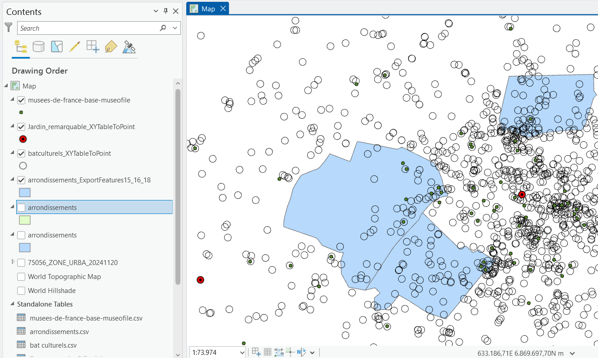

# siryna22.github.io
test

Notre analyse se penche sur l'offre culturelle du département de Paris, plus précisément, au sein des 15e, 16e et 18e arrondissements. Elle se décline selon deux aspects: la répartition des équipements culturels que ce soit les musées et les autres bâtiments à caractère culturels ainsi qu'une comparaison entre la qualité de l'offre culturelle au sein de ces arrondissements au regard de variables socio-économiques de la population. Nos données sont majoritairement extraites de l'INSEE et les données géographiques sont issus de data.gouv ainsi que du géoportail de l'urbanisme pour le PLU. Il nous a été difficile de charger l'environnement de charger l'environnement de travail de R à Github. Nous avons donc mis une photo pour montrer les sources que nous avons pu utiliser pour notre projet. 

<!-- index.html -->
<!DOCTYPE html>
<html>
<head>
  <meta charset="UTF-8">
  <title>Ma carte</title>
</head>
<body>
  <h1>Carte de la répartition différente des offres culturelles à l'échelle de Paris dans les 15e, 16e et 18e arrondissements</h1>
  
</body>
</html>
Cette carte nous montre la répartition des musées et des bâtiments culturels à l'échelle des 15e, 16e et 18e arrondissements de Paris. On peut voir une plus forte présence des bâtiments culturels dans les 15e et 16e arrondissements que dans le 18e arrondissement même s'il est à constater que l'on voit une forte concentration dans le 18e arrondissement vers la limite avec le 9e arrondissement, qui compose le centre de Paris. 
Néanmoins, il nous a été difficile de trouver les revenus socio-économiques à l'échelle de Paris au sein d'un fichier csv. Nous n'avons pas pu établir une carte comparative entre la qualité de l'offre culturelle au sein de ces arrondissements et les revenus socio-économiques de la population. Nous avons pu trouver un dossier sur l'INSEE sur le département de Paris qui montre que c'est la catégorie des Cadres qui gagnent plus, au niveau horaire, que les autres catégories socio-professionnelles: les professions intermédiaires, les employés et les ouvriers pour l'année 2022. On peut supposer que la catégorie socio-professionnelle des cadres est beaucoup plus présente dans les 16e et 15e arrondissements quand dans le 18e arrondissement ce qui pourrait expliquer une meilleure accessibilité aux bâtiments culturels et aux musées. 
En terme d'aides, l'Etat participe au financement de la culture au moyen de financements et de subventionsavec les collectivités territoriales qui restent un levier de financement important notamment par les mairies, les Directions Régionales des Affaires Culturelles: le Pass Culture pour les jeunes de 17 à 18 ans est aussi un levier de promotion et d'accessibilité à la culture mais il convient de supposer que probablement tous les ménages, notamment ceux qui sont les plus défavorisés n'ont pas accès dû possiblement à un manque d'information ou de communication. 

